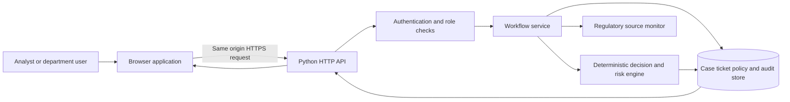
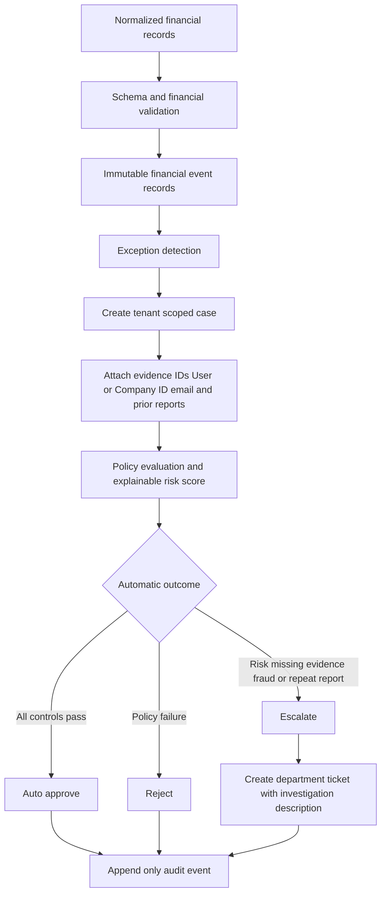
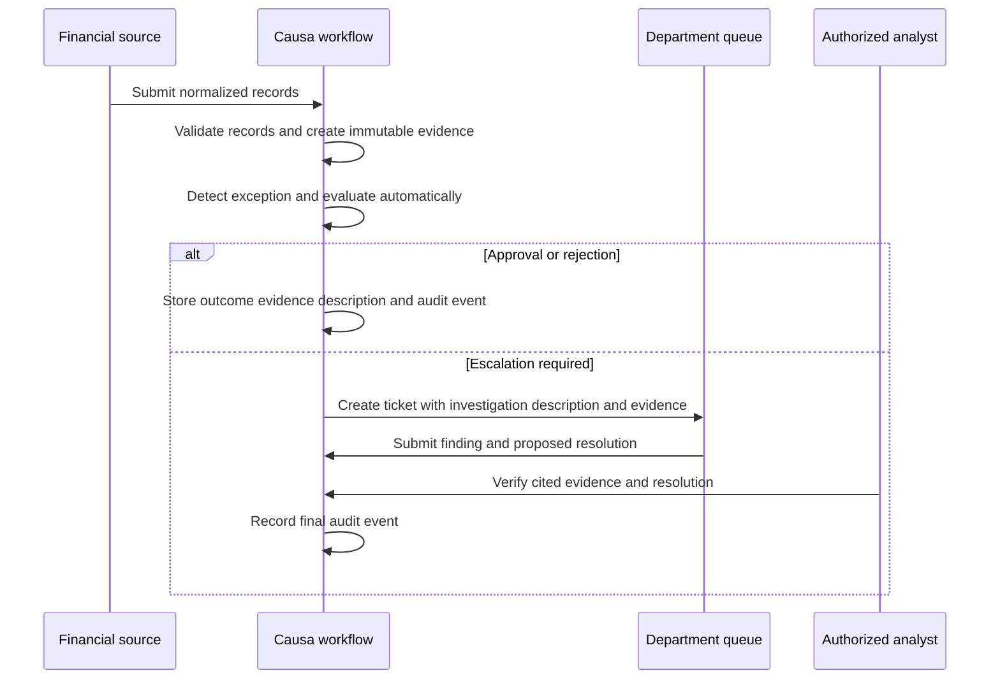

# Causa

Causa — AI Financial Exception Resolution & Risk Management System is an evidence-driven financial exception investigation application. It helps operations teams detect payment discrepancies, build a case from normalized records, assess explainable risk, route work to the right department, retain audit evidence, and verify a submitted resolution.

The project is designed as a safe demonstration and integration foundation for financial operations. It performs no payment action, holds no funds, and does not declare fraud. It keeps high-impact decisions under human control.

## Why this project matters

Payment operations reconcile information from payment, fee, refund, settlement, adjustment and bank sources. Manual review makes it hard to connect evidence, identify repeat reports, explain a risk decision, and preserve a trustworthy audit trail.

Causa addresses that gap by:

- Detecting settlement, fee, refund, adjustment, bank, timing, duplicate and suspicious-activity exceptions.
- Storing normalized source records as immutable financial events with a SHA-256 content hash.
- Keeping case, ticket and audit records tenant-scoped.
- Hash-chaining newly recorded audit events by tenant, with an admin integrity check endpoint.
- Explaining the risk factors and routing rules behind each decision.
- Escalating incomplete, conflicting, repeat and suspicious cases for human investigation.
- Supporting controlled discovery of RBI and NPCI publications without automatically changing policy.

## Current operating boundary

This repository runs a local demo at `127.0.0.1` with a SQLite database and synthetic data. The server refuses non-loopback binding and rejects `CAUSE_AI_ENV=production`.

The company will own production deployment, public availability, identity, cloud resources, and its later real-data approval. Until then, the application uses fictional sample records and Razorpay’s publicly documented API field shape. Public documentation does **not** provide real Razorpay transaction data.

## Requirements

- Python 3.11 or newer
- Windows PowerShell, macOS shell, or Linux shell
- A modern browser

Install the small open-source runtime dependency before starting:

```powershell
python -m pip install -r requirements.txt
```

## Optional OpenRouter investigation

Causa works without an AI provider. In that mode it explicitly labels investigation output as deterministic fallback; it never represents it as LLM-generated analysis.

To use OpenRouter, copy `.env.example` to `.env` locally and set these values there. The application loads `.env` locally without overwriting variables already supplied by the operating system. Keep the fields blank in source control.

```env
AI_PROVIDER=openrouter
OPENROUTER_API_KEY=paste-your-key-here
OPENROUTER_MODEL=nvidia/nemotron-3.5-lightning:free
```

```powershell
$env:AI_PROVIDER = "openrouter"
$env:OPENROUTER_API_KEY = "paste-your-key-here"
$env:OPENROUTER_MODEL = "nvidia/nemotron-3.5-lightning:free"
```

For Vercel, add `AI_PROVIDER`, `OPENROUTER_API_KEY`, and `OPENROUTER_MODEL` in **Project Settings → Environment Variables**. Do not paste the key into frontend code, a README, an issue, a chat, or any committed `.env` file. Vercel encrypts environment variables at rest and injects them only into server functions. Rotate the key immediately if it is ever exposed.

The supplied model slug is a free-tier example, not a guaranteed permanent free offering. Confirm its availability in OpenRouter before enabling it. Causa uses the standard OpenRouter server-side chat-completions API with an Authorization Bearer header. [OpenRouter chat-completions documentation](https://openrouter.ai/docs/api/api-reference/chat/send-chat-completion-request)

The AI investigation receives only a minimized case context. It can summarize, identify unknowns, cite supplied evidence and recommend a route. It cannot approve or move money, alter policy, change audit history, claim confirmed fraud, or override deterministic decisions.

## Deployment modes

| Mode | Storage and AI | Intended use |
|---|---|---|
| Local zero-cost | SQLite, local filesystem, deterministic fallback | Development and complete synthetic workflow |
| Vercel demo | Synthetic data, ephemeral SQLite, deterministic fallback or optional configured OpenRouter provider | Public submission demonstration only |
| Future production | Durable PostgreSQL, persistent sessions, approved identity and AI provider, object storage | Company-owned deployment after approvals |

## Installation and start

### Quick start

1. Install Python 3.11 or later from [python.org](https://www.python.org/downloads/).
2. Open PowerShell in this project folder.
3. Run `./run.ps1`.
4. Open <http://127.0.0.1:8000> in a browser.

After installing `requirements.txt`, the local synthetic demo creates `data/cause_ai.sqlite3` and seeds fictional cases on first start. Use `Ctrl+C` in the terminal to stop it.

### Windows PowerShell

```powershell
Set-Location "D:\projects\AI Financial Exception Resolution & Risk Management"
$env:PYTHONPATH = "$PWD\src"
python -m cause_ai
```

Or use the supplied script:

```powershell
.\run.ps1
```

Open <http://127.0.0.1:8000>. The first run creates `data/cause_ai.sqlite3` and seeds the demo workspace. Stop the server with `Ctrl+C`.

To verify the application before running it:

```powershell
.\test.ps1
```

### macOS and Linux

```bash
cd "AI Financial Exception Resolution & Risk Management"
PYTHONPATH=src python3 -m cause_ai
```

Open <http://127.0.0.1:8000>.

## Demo accounts

| Username | Role | Main capabilities |
|---|---|---|
| `analyst` | Finance analyst | Review cases, run detection, evaluate cases, verify resolutions. |
| `department` | Department reviewer | Review assigned tickets, record findings, submit evidence-cited resolutions. |
| `admin` | Demo administrator | Run all demo workflows and review regulatory updates. |

All local demo accounts use password `CauseDemo!2026`. These credentials are deliberately limited to synthetic local use.

## Try the workflow

1. Sign in as `analyst`.
2. Open **Detection lab**.
3. Select **Load Razorpay public-schema sample**. The sample contains fictional data shaped from Razorpay’s public payment API documentation.
4. Select **Analyze records**. The sample shows a settlement mismatch and its evidence identifiers.
5. Create and route the finding. Detection evaluates evidence, policy, risk, authority, and repeat history automatically in the same transaction. The unverified sample therefore routes to investigation automatically.
6. Sign in as `department` to record an investigation finding and submit a resolution.
7. Sign in as `analyst` to perform the final verification workflow.

The sample file is at [razorpay_public_schema_sample.json](src/cause_ai/static/samples/razorpay_public_schema_sample.json). Its rules and data boundary are described in [samples README](src/cause_ai/static/samples/README.md).

On startup, Causa also evaluates any historical pending case automatically. New detected cases are evaluated during their creation transaction. Automatic evaluation can approve, reject, or create an escalation ticket; it never executes a payment, refund, settlement, or adjustment.

## Razorpay Test Mode integration

The read-only connector supports explicit Test Mode and Live Mode. Both require company-owned credentials and a tenant mapping. Do not place credentials in source code or share them in chat.

For a company-provided Test Mode environment, configure the process securely:

```text
RAZORPAY_MODE=test
RAZORPAY_ALLOW_TEST_READ_ONLY_IMPORT=true
RAZORPAY_KEY_ID=<company test key ID>
RAZORPAY_KEY_SECRET=<company test key secret>
RAZORPAY_TENANT_ID=DEMO-MERCHANT-01
```

The import endpoint is `POST /api/integrations/razorpay/payments/import`. It is admin-only, read-only, tenant-matched, response-bounded, and records imports as `RAZORPAY_TEST_PAYMENTS_API`. Test evidence remains unverified and cannot authorise a real payment action.

Razorpay’s official Test Mode uses mock payment flows and test keys. See [Razorpay Test Mode documentation](https://razorpay.com/docs/server-integration/python/test-app/).

## Automated tests

```powershell
.\test.ps1
```

Or:

```powershell
$env:PYTHONPATH = "$PWD\src"
python -m unittest discover -s tests -v
```

The suite covers financial calculation, validation, tenant isolation, roles, sessions, HTTP security controls, immutable audit data, immutable financial events, automatic routing, regulatory safeguards, Razorpay configuration and the public-schema sample route.

## Deterministic benchmark

Run the reproducible 100-scenario benchmark without OpenRouter:

```powershell
$env:PYTHONPATH = "$PWD\src"
python -m cause_ai.benchmark.runner
```

It generates versioned scenarios and ground truth in `benchmarks/`, plus measured output in `reports/benchmark_results.json`. The current synthetic regression dataset has 80 expected exceptions and 20 normal scenarios. Its results measure the encoded deterministic rules, not real financial data performance.

`GET /api/audit/integrity` is admin-only. It verifies the append-only SHA-256 chain created from schema v5 onward and reports its coverage explicitly after a migration.

## Health and readiness

- `GET /api/health` confirms that the local HTTP process can read its SQLite database.
- `GET /api/ready` confirms the database is available and has the required schema version.
- Every HTTP response includes an `X-Request-ID`; server logs use the same value for troubleshooting without exposing request bodies or credentials.

## Deployment preflight

Before a company-owned production service is released, run the secret-safe preflight check in its deployment environment:

```powershell
$env:PYTHONPATH = "$PWD\src"
python -m cause_ai.preflight
```

It requires a PostgreSQL connection declaration, OIDC configuration, a sufficiently long session-signing key, HTTPS origins, observability, object storage, a durable worker queue, a backup plan ID, and explicit data-governance and security approvals. It prints only check names and never prints secret values. This local demo remains deliberately blocked from production mode.

## Containerised demo

The repository includes a non-root container configuration with a read-only filesystem, dropped Linux capabilities, a health check, and loopback-only port publishing. It packages only the synthetic demo:

```powershell
docker compose -f deployment/compose.demo.yml up --build
```

See [deployment instructions](deployment/README.md). The GitHub Actions workflow compiles the code, runs the test suite, and confirms that a missing production configuration fails closed.

## Project structure

```text
.
├── README.md
├── run.ps1                         # Start local demo
├── test.ps1                        # Run automated tests
├── src/cause_ai/
│   ├── database.py                 # SQLite schema, fixtures, audit storage
│   ├── domain.py                   # Detection, money, risk and decision rules
│   ├── service.py                  # Case and investigation workflow
│   ├── razorpay.py                 # Read-only Test and Live Mode connector
│   ├── regulatory.py               # RBI and NPCI discovery safeguards
│   ├── server.py                   # Local HTTP API and session security
│   └── static/                     # Browser application and public-schema sample
├── tests/test_cause_ai.py
├── legal/                          # Counsel-review templates
├── reports/                        # Readiness and legal submission report
├── presentations/                  # Review presentation
└── docs/                           # Requirements, architecture and API reference
```

## Architecture and AI use

## Free Vercel submission deployment

The public synthetic-data submission deployment is available at [Causa on Vercel](https://causa-ai-financial-exception.vercel.app). It runs the browser application and Python API on Vercel's free serverless runtime. The adapter initializes fictional demo data and enables the complete sign-in, case review, automatic evaluation, evidence, AI investigation, department-ticket and audit workflow.

Vercel serverless storage is temporary in this free submission configuration. It must not be used for customer, payment or company data because cases, tickets and sessions can reset when a function instance is replaced. The included production preflight remains the required gate for a company deployment with managed PostgreSQL, Redis or equivalent durable sessions, company identity, backups and monitoring.

To redeploy the free submission build from this repository:

```powershell
vercel deploy --prod --yes
```

### Architecture design

The browser application communicates with a Python HTTP API over same-origin requests. The API authenticates the user, applies role and tenant checks, and invokes the workflow service. The workflow service stores cases, tickets, policy versions, financial events, regulatory evidence and append-only audit events in the database. The static interface renders the case queue, evidence, automatic outcome, previous case history and department ticket from those scoped API responses.

```text
Browser interface -> HTTP API and session controls -> Workflow service
                                                -> Decision and risk engine
                                                -> SQLite demo data store
                                                -> Append-only audit hash chain
                                                -> Regulatory source monitor
```

The repository also includes the target production boundary: managed PostgreSQL for durable data, company SSO for identity, secrets management, object storage for retained evidence, centralized observability and a durable worker queue. These services must be supplied by the company before public deployment.



### Backend design

The backend accepts normalized payment, settlement, refund, fee, adjustment and bank records. It uses decimal arithmetic, immutable source-event hashes and tenant-scoped database queries. The detector creates a case, attaches evidence identifiers, calculates explainable risk, applies the approved policy version and records an automatic decision in the same transaction. Escalations create a department ticket containing a separate investigation description. The system does not execute payments, refunds, account changes or other financial actions.



### Workflow design

1. A source record bundle is validated and normalized.
2. The system detects financial exceptions and saves immutable financial events.
3. It creates a tenant-scoped case with User or Company ID, email when supplied, evidence, and prior-report links.
4. The deterministic engine automatically approves, rejects or escalates the case.
5. The case view shows the evidence description used for the decision.
6. An escalated case creates a department ticket with an investigation description, risk, policy and related case history.
7. A department submits findings and a proposed resolution; an authorized analyst independently verifies the resolution.
8. Every material action is recorded in the append-only audit trail.



Causa uses deterministic, explainable decision logic for financial outcomes. Its optional bounded AI investigation layer can summarize controlled case context, identify unknowns and cite supplied evidence. AI output is advisory, schema-validated and cannot override policy, risk, permissions, audit history or financial decisions.

This design helps reviewers inspect evidence and challenge outcomes. A future statistical or machine-learning model must complete data-governance, model-risk, evaluation, monitoring and human-override reviews before it influences material decisions.

## Legal and regulatory materials

- [Legal Terms and Privacy Template](legal/CAUSA_Legal_Terms_and_Privacy_Template.docx)
- [Production Readiness and Legal Submission Report](reports/CAUSA_Production_Readiness_and_Legal_Submission_Report.docx)
- [Legal and Production Readiness Presentation](presentations/CAUSA_Legal_and_Production_Readiness_Review.pptx)
- [In-app Terms and Privacy page](src/cause_ai/static/legal.html)

The templates require company legal, privacy and security review before publication. They do not guarantee compliance.

## API and design documents

- [API reference](docs/API.md)
- [Project overview](docs/PROJECT_OVERVIEW.md)
- [Architecture](docs/architecture/ARCHITECTURE.md)
- [Industry-grade target design](docs/INDUSTRY_GRADE_TARGET_DESIGN.md)
- [Implementation status](docs/IMPLEMENTATION_STATUS.md)

## License

No license has been selected. Do not redistribute this project under an assumed license.

By Potheesh Vignesh K